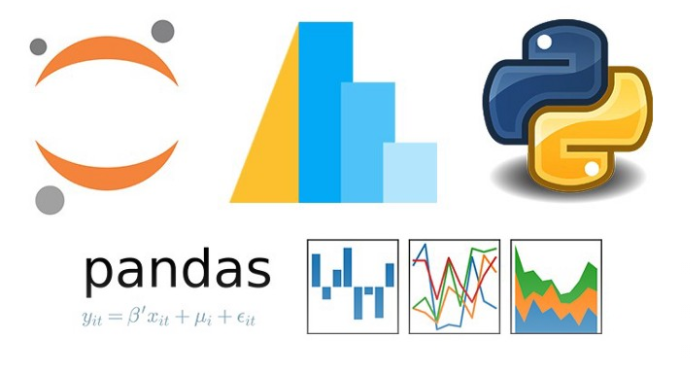

Data provided by :https://www.kaggle.com/makarandrayate/ecommerce-uk-retailer

The Ecommerce_UK_Retailer data analysis by using Python libraries.

### Problem Statements:
1. Perform Basic EDA

a. Boxplot – All Numeric Variables

b. Histogram – All Numeric Variables

c. Distribution Plot – All Numeric Variables

d. Aggregation for all numerical Columns

e. Unique Values across all columns

f. Duplicate values across all columns

g. Correlation – Heatmap - All Numeric Variables

h. Regression Plot - All Numeric Variables

i. Bar Plot – Every Categorical Variable vs every Numerical Variable

j. Pair plot - All Numeric Variables

k. Line chart to show the trend of data - All Numeric/Date Variables

l. Plot the skewness - All Numeric Variables

2. Check for missing values in all columns and replace them with the appropriate metric (Mean/Median/Mode)

3. Remove duplicate rows

4. Remove rows which have negative values in Quantity column

5. Add the columns - Month, Day and Hour for the invoice

6. How many orders made by the customers?

7. TOP 5 customers with higher number of orders

8. How much money spent by the customers?

9. TOP 5 customers with highest money spent

10. How many orders per month?

11. How many orders per day?

12. How many orders per hour?

13. How many orders for each country?

14. Orders trend across months

15. How much money spent by each country?

